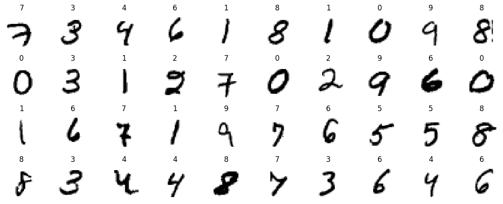
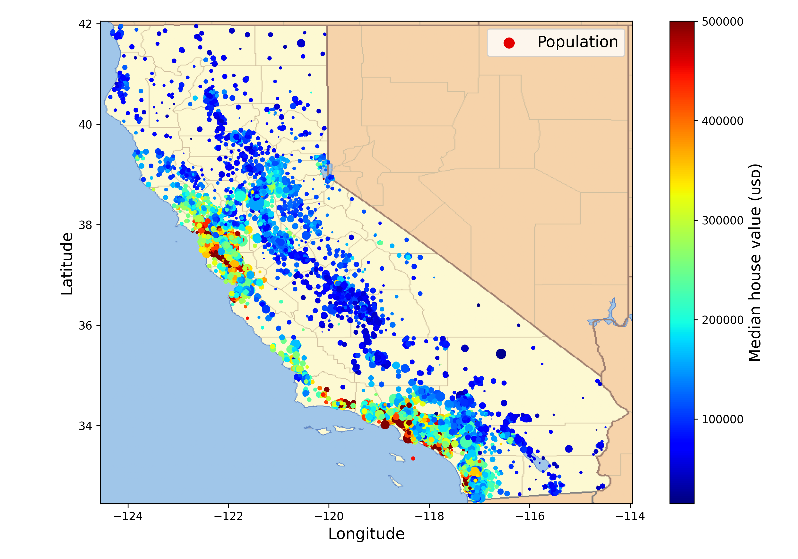
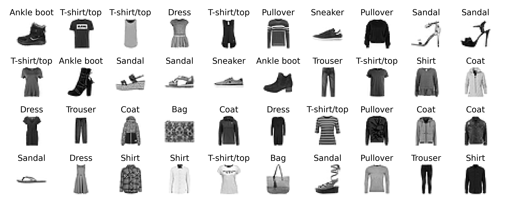

## Basics

<table style="width:100%">
  <tr>
    <th>
      

           </a>
            MNIST classification
            <a href="./mnist.ipynb" name="mnist_code">(code)</a>
      

    </th>
        <th>

           </a>
            California housing price prediction
            <a href="./housing_price_prediction.ipynb" name="chpp_code">(code)</a>
        

    </th>
       <th>

           </a>
            Fashion MNIST classification
            <a href="" name="fmnist_code">(code)</a>
        

  </tr>
  <tr>
</table>

## Applications

